# POSSE Feature Flow Diagrams

This document contains comprehensive flow diagrams for all features implemented in POSSE (Publish Own Site, Syndicate Elsewhere).

## Table of Contents

1. [System Overview](#1-system-overview)
2. [Ghost Webhook Integration](#2-ghost-webhook-integration)
3. [Event Processing Pipeline](#3-event-processing-pipeline)
4. [Content Formatting](#4-content-formatting)
5. [Multi-Account Syndication](#5-multi-account-syndication)
6. [Image Processing](#6-image-processing)
7. [LLM Alt Text Generation](#7-llm-alt-text-generation)
8. [Tag-Based Filtering](#8-tag-based-filtering)
9. [Post Splitting](#9-post-splitting)
10. [Interaction Sync](#10-interaction-sync)
11. [IndieWeb News Syndication](#11-indieweb-news-syndication)
12. [Pushover Notifications](#12-pushover-notifications)
13. [Health Check System](#13-health-check-system)
14. [Configuration Loading](#14-configuration-loading)

---

## 1. System Overview

High-level architecture showing how all components interact.


---

## 2. Ghost Webhook Integration

Flow for receiving and validating Ghost CMS webhooks.

```mermaid
flowchart TD
    A[Ghost publishes/updates post] -->|HTTP POST| B[/webhook/ghost endpoint]

    B --> C{Content-Type valid?}
    C -->|No| D[Return 400 Bad Request]
    C -->|Yes| E[Parse JSON body]

    E --> F{JSON valid?}
    F -->|No| G[Return 400 Bad Request]
    F -->|Yes| H[Validate against JSON Schema]

    H --> I{Schema valid?}
    I -->|No| J[Log validation error]
    J --> K[Send Pushover notification]
    K --> L[Return 400 Bad Request]

    I -->|Yes| M[Extract post data]
    M --> N{Post has 'current' key?}
    N -->|Yes| O[Use post.current]
    N -->|No| P[Use post directly]

    O --> Q[Extract: title, url, excerpt, tags, images]
    P --> Q

    Q --> R[Log post received]
    R --> S[Send 'Post Received' notification]
    S --> T[Push to events_queue]
    T --> U[Send 'Post Queued' notification]
    U --> V[Return 200 OK]

    style D fill:#f66
    style G fill:#f66
    style L fill:#f66
    style V fill:#6f6
```

### Webhook Payload Structure


---

## 3. Event Processing Pipeline

Main processing loop that handles queued posts.


### Parallel Posting Detail


---

## 4. Content Formatting

How post content is formatted for each platform.

```mermaid
flowchart TD
    A[Raw Ghost Post] --> B[Extract base content]

    B --> C[Get title]
    B --> D[Get URL]
    B --> E[Get excerpt or generate from HTML]
    B --> F[Get tags as hashtags]

    C --> G[Build content template]
    D --> G
    E --> G
    F --> G

    G --> H{Platform type?}

    H -->|Mastodon| I[Apply 500 char limit]
    H -->|Bluesky| J[Apply 300 char limit]

    I --> K[Truncate excerpt if needed]
    J --> K

    K --> L[Add #posse hashtag]
    L --> M[Add post URL]
    M --> N[Add service-specific tags]

    N --> O[Final formatted content]

    subgraph Template["Content Template"]
        direction LR
        T1["📝 {title}"] --> T2["{excerpt}..."]
        T2 --> T3["#{tag1} #{tag2}"]
        T3 --> T4["#posse"]
        T4 --> T5["{url}"]
    end

    O --> Template
```



### Character Limit Handling


---

## 5. Multi-Account Syndication

Support for multiple accounts per platform.


### Account Selection Flow


---

## 6. Image Processing

Comprehensive image handling pipeline.


### Image Cache Structure


---

## 7. LLM Alt Text Generation

Vision LLM integration for accessibility.


### LLM Request Flow


---

## 8. Tag-Based Filtering

How posts are routed to specific accounts.


### Tag Matching Logic


---

## 9. Post Splitting

Multi-image post splitting for better display.


### Split Post Structure


---

## 10. Interaction Sync

Background service for syncing social interactions.


### Interaction Data Structure


### API Endpoint Flow


---

## 11. IndieWeb News Syndication

Webmention-based syndication to IndieWeb News.

```mermaid
flowchart TD
    A[Post processing complete] --> B{Post has 'indiewebnews' tag?}

    B -->|No| C[Skip IndieWeb News]
    B -->|Yes| D[Prepare webmention]

    D --> E[Source URL = Post URL]
    E --> F[Target URL = news.indieweb.org/en]

    F --> G[Discover webmention endpoint]
    G --> H{Endpoint found?}

    H -->|No| I[Log error - no endpoint]
    H -->|Yes| J[Send webmention POST]

    J --> K{Response status?}

    K -->|2xx| L[Success - log and notify]
    K -->|4xx| M[Client error - log details]
    K -->|5xx| N[Server error - log and retry?]

    L --> O[Send success notification]
    M --> P[Send failure notification]
    N --> P

    C --> Q[Continue processing]
    O --> Q
    P --> Q
```

### Webmention Protocol

```mermaid
sequenceDiagram
    participant P as POSSE
    participant IWN as IndieWeb News

    Note over P: Post has #indiewebnews tag

    P->>IWN: HEAD / GET to discover endpoint
    IWN-->>P: Link header or HTML with webmention endpoint

    P->>P: Parse endpoint URL

    P->>IWN: POST to webmention endpoint
    Note over P,IWN: Form data: source={post_url}&target={news_url}

    alt Accepted
        IWN-->>P: 202 Accepted
        Note over P: Submission queued for review
    else Already submitted
        IWN-->>P: 200 OK (duplicate)
    else Error
        IWN-->>P: 4xx/5xx Error
    end
```

---

## 12. Pushover Notifications

Real-time push notification system.

```mermaid
flowchart TD
    subgraph Events["Notification Triggers"]
        E1[Post received from Ghost]
        E2[Post queued for syndication]
        E3[Post successfully published]
        E4[Validation error]
        E5[Posting error]
        E6[IndieWeb News submission]
        E7[LLM service issue]
    end

    Events --> A{Pushover configured?}

    A -->|No| B[Skip notification]
    A -->|Yes| C[Build notification payload]

    C --> D[Set title based on event type]
    D --> E[Set message with details]
    E --> F[Add URL if applicable]

    F --> G[Send to Pushover API]
    G --> H{Response?}

    H -->|Success| I[Log notification sent]
    H -->|Failure| J[Log error - continue processing]

    B --> K[Continue main flow]
    I --> K
    J --> K
```

### Notification Types

```mermaid
flowchart LR
    subgraph Types["Notification Categories"]
        direction TB

        subgraph Info["Informational"]
            I1["📥 Post Received"]
            I2["📤 Post Queued"]
            I3["✅ Post Published"]
        end

        subgraph Warning["Warnings"]
            W1["⚠️ LLM Unavailable"]
            W2["⚠️ Partial Failure"]
        end

        subgraph Error["Errors"]
            E1["❌ Validation Failed"]
            E2["❌ Posting Failed"]
            E3["❌ Service Error"]
        end

        subgraph IndieWeb["IndieWeb"]
            IW1["🌐 Submitted to IndieWeb News"]
            IW2["❌ Webmention Failed"]
        end
    end
```

---

## 13. Health Check System

Service health monitoring endpoints.

```mermaid
flowchart TD
    subgraph Endpoints["Health Endpoints"]
        H1["GET /health<br/>Simple liveness probe"]
        H2["POST /healthcheck<br/>Comprehensive check"]
    end

    H1 --> A[Return 200 OK immediately]

    H2 --> B[Initialize checks]

    B --> C[Check Mastodon accounts]
    B --> D[Check Bluesky accounts]
    B --> E[Check LLM service]
    B --> F[Check Pushover service]

    C --> G[Verify credentials for each account]
    D --> H[Verify credentials for each account]
    E --> I[Test LLM API connectivity]
    F --> J[Test Pushover API]

    G --> K[Collect results]
    H --> K
    I --> K
    J --> K

    K --> L{All checks passed?}
    L -->|Yes| M[Return 200 with full status]
    L -->|No| N[Return 200 with degraded status]

    subgraph Response["Response Structure"]
        R1["status: 'healthy' | 'degraded'"]
        R2["services: { mastodon, bluesky, llm, pushover }"]
        R3["accounts: [ { name, status, error? } ]"]
    end

    M --> Response
    N --> Response
```

### Health Check Detail

```mermaid
sequenceDiagram
    participant C as Client
    participant H as Health Endpoint
    participant M as Mastodon Clients
    participant B as Bluesky Clients
    participant L as LLM Client
    participant P as Pushover

    C->>H: POST /healthcheck

    par Check all services
        H->>M: Verify credentials
        M-->>H: OK / Error per account
    and
        H->>B: Verify credentials
        B-->>H: OK / Error per account
    and
        H->>L: Test connectivity
        L-->>H: OK / Error
    and
        H->>P: Test API
        P-->>H: OK / Error
    end

    H->>H: Aggregate results
    H-->>C: JSON status report
```

---

## 14. Configuration Loading

How configuration is loaded and validated.

```mermaid
flowchart TD
    A[Application Start] --> B[Load config.yml]

    B --> C{File exists?}
    C -->|No| D[Use defaults / environment vars]
    C -->|Yes| E[Parse YAML]

    E --> F[Check for Docker secrets]
    F --> G{Secrets available?}

    G -->|Yes| H[Override with secret values]
    G -->|No| I[Use config file values]

    H --> J[Build configuration object]
    I --> J
    D --> J

    J --> K[Initialize LLM client if configured]
    J --> L[Initialize Pushover if configured]
    J --> M[Initialize Mastodon accounts]
    J --> N[Initialize Bluesky accounts]
    J --> O[Initialize Interaction Scheduler]
    J --> P[Configure IndieWeb settings]

    K --> Q[Create Flask app]
    L --> Q
    M --> Q
    N --> Q
    O --> Q
    P --> Q

    Q --> R[Start Gunicorn server]
```

### Configuration Structure

```mermaid
flowchart TD
    subgraph Config["config.yml Structure"]
        direction TB

        subgraph LLM["llm (optional)"]
            L1[base_url]
            L2[model]
            L3[timeout]
        end

        subgraph Pushover["pushover (optional)"]
            P1[user_key / user_key_file]
            P2[api_token / api_token_file]
        end

        subgraph Mastodon["mastodon"]
            subgraph MA["accounts[]"]
                M1[name]
                M2[instance_url]
                M3[access_token / access_token_file]
                M4[tags]
                M5[split_multi_image_posts]
                M6[char_limit]
            end
        end

        subgraph Bluesky["bluesky"]
            subgraph BA["accounts[]"]
                B1[name]
                B2[handle]
                B3[app_password / app_password_file]
                B4[tags]
                B5[split_multi_image_posts]
            end
        end

        subgraph Interactions["interactions (optional)"]
            I1[enabled]
            I2[storage_path]
            I3[sync_interval_minutes]
            I4[max_post_age_days]
        end

        subgraph IndieWeb["indieweb (optional)"]
            IW1[news_enabled]
            IW2[news_tag]
        end
    end
```

### Docker Secrets Integration

```mermaid
flowchart LR
    subgraph Secrets["/run/secrets/"]
        S1[mastodon_token_account1]
        S2[bluesky_password_account1]
        S3[pushover_user_key]
        S4[pushover_api_token]
    end

    subgraph Config["config.yml references"]
        C1["access_token_file: /run/secrets/..."]
        C2["app_password_file: /run/secrets/..."]
        C3["user_key_file: /run/secrets/..."]
        C4["api_token_file: /run/secrets/..."]
    end

    C1 -->|Read at startup| S1
    C2 -->|Read at startup| S2
    C3 -->|Read at startup| S3
    C4 -->|Read at startup| S4

    Secrets --> A[Loaded into memory]
    A --> B[Never logged or exposed]
```

---

## Summary

This document covers all major features of the POSSE application:

| Feature | Primary Files | Key Components |
|---------|--------------|----------------|
| Ghost Webhook | `ghost.py`, `ghost_post_schema.json` | Flask endpoint, JSON Schema validation |
| Event Processing | `posse.py` | Queue, ThreadPoolExecutor, daemon thread |
| Content Formatting | `posse.py` | Character limits, hashtags, URL handling |
| Multi-Account | `mastodon_client.py`, `bluesky_client.py` | Per-account config, parallel posting |
| Image Processing | `posse.py`, `base_client.py` | SHA-256 caching, download, cleanup |
| LLM Alt Text | `llm_client.py` | Vision model, base64 encoding, timeout |
| Tag Filtering | `posse.py` | Case-insensitive matching, account routing |
| Post Splitting | `posse.py` | #nosplit bypass, thread creation |
| Interaction Sync | `interaction_sync.py`, `scheduler.py` | Background sync, JSON caching, API |
| IndieWeb News | `webmention.py` | W3C Webmention, endpoint discovery |
| Pushover | `pushover.py` | Event notifications, error alerts |
| Health Checks | `ghost.py` | Liveness, comprehensive service checks |
| Configuration | `config/__init__.py` | YAML, Docker secrets, validation |

All diagrams use [Mermaid](https://mermaid.js.org/) syntax and can be rendered in GitHub, GitLab, and other markdown viewers with Mermaid support.
