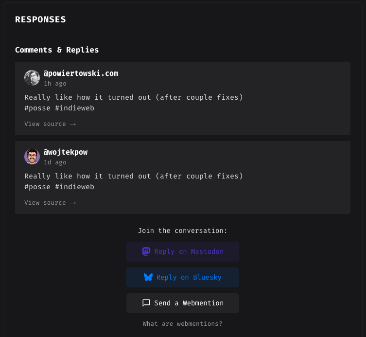

# Social Interactions Widget

This widget displays social media interactions (comments, likes, reposts) from Mastodon and Bluesky for syndicated Ghost blog posts, along with Webmentions and optional Disqus comments.

## Screenshot



The widget displays:
- **Social engagement section**: Shows aggregated likes, reposts, and replies from POSSE-syndicated posts on Mastodon and Bluesky
- **Responses section**: Unified display combining POSSE replies and Webmentions:
  - Facepile of likes and reposts (from webmention.io)
  - Combined comment threads from both POSSE platforms and Webmentions
  - Empty state with "Reply on Mastodon/Bluesky" and "Send a Webmention" options
  - Optional self-hosted reply form for readers without their own site
  - "Join the conversation" section with platform-specific reply links
- **Disqus integration** (optional): Traditional comment system support

## Installation

### For Ghost Code Injection

1. Copy the contents of `social-interactions-widget.html`
2. In Ghost Admin, go to your post Settings > Code Injection > Post Footer
3. Paste the code
4. Replace the placeholders:
   - `POSSE_API_URL` with your POSSE service URL
   - `POST_ID` with your Ghost post ID
   - `POST_URL` with your post's absolute URL
   - `WEBMENTION_DOMAIN` with your domain

### For Ghost Theme Integration

1. Save the widget code as a partial in your theme (e.g., `partials/social-interactions.hbs`)
2. Configure custom theme settings (in `package.json`):
   - `posse_api_url`: Your POSSE service API URL
   - `webmention_domain`: Your domain for webmentions
   - `webmention_reply_url`: URL to your webmention reply page (defaults to `/webmention-reply.html`)
   - `enable_disqus` (boolean): Enable Disqus comments
   - `disqus_shortname`: Your Disqus shortname

3. The widget uses Handlebars variables:
   - `{{id}}` - Ghost post ID
   - `{{url absolute="true"}}` - Absolute post URL
   - `{{@custom.posse_api_url}}` - POSSE API URL from theme settings
   - `{{@custom.webmention_domain}}` - Webmention domain from theme settings
   - `{{@custom.webmention_reply_url}}` - Reply form URL from theme settings
   - `{{@custom.enable_disqus}}` - Disqus enable flag
   - `{{@custom.disqus_shortname}}` - Disqus shortname

4. Include in your `post.hbs`:
   ```handlebars
   {{> "social-interactions"}}
   ```

## Features

### POSSE Integration
- Fetches engagement stats from your POSSE service API
- Displays aggregated counts of likes, reposts, and replies across Mastodon and Bluesky
- Shows last updated timestamp with relative time formatting
- Hides widget when no POSSE data is available

### Unified Comment Display
- **POSSE Reply Integration**: Extracts reply previews from POSSE platforms and displays them alongside webmentions
- **Combined Threading**: Merges POSSE replies and webmentions into a unified, chronologically sorted comment thread
- **Reply Metadata**: Shows author name, avatar, timestamp, and platform source for each reply
- **Content Sanitization**: Properly escapes POSSE replies and sanitizes webmention HTML

### Webmentions
- Fetches mentions from webmention.io API
- Categorizes by type: likes, reposts, comments, and mentions
- Displays likes and reposts as avatar facepiles (up to 20 avatars with "+N" overflow)
- Shows full comment threads with author info and timestamps

### Syndication Links
- **Smart Discovery**: Automatically discovers syndicated post URLs from POSSE data
- **Fallback Support**: Uses `syndication_links` first, falls back to `platforms` data
- **Split Post Handling**: Handles Mastodon/Bluesky thread splits, uses first post URL
- **Platform Icons**: Displays SVG icons for Mastodon, Bluesky, and generic webmentions
- Shows "Reply on Mastodon/Bluesky" buttons in both empty state and below comments
- Provides "Send a Webmention" option linking to your configurable reply page
- Includes a static starter page at `widget/webmention-reply.html` that posts replies to a relay endpoint

### Disqus Integration (Optional)
- Supports traditional Disqus comment system
- Configurable via `enable_disqus` and `disqus_shortname` theme settings
- Loads asynchronously without blocking other widget features

### User Experience
- **Dark Mode**: Automatic dark mode support via CSS media queries
- **Responsive Design**: Mobile-friendly layout
- **Auto-refresh**: Polls for updates every 5 minutes (300,000ms)
- **Error Handling**: Graceful fallback when API requests fail
- **Loading States**: Shows appropriate empty states with engagement prompts
- **Relative Timestamps**: Human-readable time formatting (e.g., "5m ago", "2h ago")

### Data Sharing
- POSSE widget shares data with webmentions widget via custom events
- Ensures syndication links are available even when loaded at different times
- Coordinates refresh cycles between widgets


## Anonymous reply page

Use `widget/webmention-reply.html` as a starter for a no-account reply flow.

### Why a relay endpoint is required
A valid Webmention needs a **source URL** that contains a link to the target post. A static page alone cannot create a unique, crawlable source per reply, so the form submits to a relay service that should:

1. Store the reply and publish it at a public source URL
2. Ensure that source URL links to the target post
3. Discover the Ghost Webmention endpoint
4. Send `application/x-www-form-urlencoded` Webmention payload (`source`, `target`)

The form accepts a `relay` query parameter so you can prefill the endpoint, for example:

`/webmention-reply.html?target=https://example.com/post&relay=https://relay.example.com/webmention-replies`
