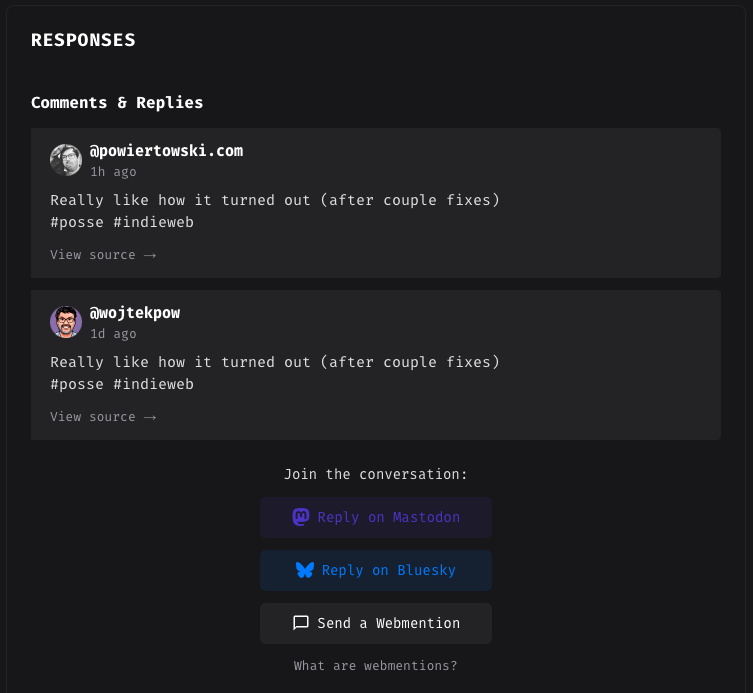

# Social Interactions Widget

This widget displays social media interactions (comments, likes, reposts) from Mastodon and Bluesky for syndicated Ghost blog posts, along with Webmentions and an optional bubbles.town vote count.

## Screenshot



The widget displays:
- **Social engagement section**: Shows aggregated likes, reposts, and replies from POSSE-syndicated posts on Mastodon and Bluesky, plus an optional bubbles.town vote count
- **Responses section**: Unified display combining POSSE replies and Webmentions:
  - Facepile of likes and reposts (from webmention.io and/or the POSSE webmentions API)
  - Combined comment threads from both POSSE platforms and Webmentions
  - Empty state with "Reply on Mastodon/Bluesky" and "Send a Webmention" options
  - "Join the conversation" section with platform-specific reply links

## Installation

### For Ghost Theme Integration

1. Save the widget code as a partial in your theme (e.g., `partials/social-interactions.hbs`)
2. Configure custom theme settings (in `package.json`):
   - `posse_api_url`: Your POSSE service API URL
   - `webmention_domain`: Your domain for webmention.io lookups
   - `webmention_api_url` (optional): URL of the POSSE self-hosted webmentions API (`/api/webmentions`); if set, merged with webmention.io results
   - `webmention_reply_url` (optional): URL of the webmention reply form (e.g. your POSSE `/webmention` endpoint); if omitted the "Send a Webmention" button is hidden
   - `bubbles_town_enabled` (boolean, optional): Show bubbles.town vote count in the engagement box

3. The widget uses Handlebars variables:
   - `{{id}}` - Ghost post ID
   - `{{url absolute="true"}}` - Absolute post URL
   - `{{@custom.posse_api_url}}` - POSSE API URL from theme settings
   - `{{@custom.webmention_domain}}` - Webmention domain from theme settings
   - `{{@custom.webmention_api_url}}` - POSSE webmentions API URL
   - `{{@custom.webmention_reply_url}}` - Webmention reply form URL
   - `{{@custom.bubbles_town_enabled}}` - bubbles.town opt-in flag

4. Include in your `post.hbs`:
   ```handlebars
   {{> "social-interactions"}}
   ```

## Features

### POSSE Integration
- Fetches engagement stats from your POSSE service API
- Displays aggregated counts of likes, reposts, and replies across Mastodon and Bluesky
- Includes received webmention replies in the reply counter
- Shows last updated timestamp with relative time formatting
- Hides widget stats when no POSSE data is available (engagement box remains visible if bubbles.town is enabled)

### bubbles.town Vote Count (Optional)
- Fetches the vote count for the post from the bubbles.town API
- Renders a linked stat slot alongside POSSE stats in the engagement box
- Enable via `bubbles_town_enabled` theme setting

### Unified Comment Display
- **POSSE Reply Integration**: Extracts reply previews from POSSE platforms and displays them alongside webmentions
- **Combined Threading**: Merges POSSE replies and webmentions into a unified, chronologically sorted comment thread
- **Reply Metadata**: Shows author name, avatar, timestamp, and platform source for each reply
- **Content Sanitization**: Escapes POSSE replies and sanitizes webmention HTML with an allowlist-based DOM sanitizer (permits only `p`, `br`, `a`, `strong`, `em`, `blockquote`, `code`, `pre`)

### Webmentions
- Fetches mentions from the POSSE self-hosted `/api/webmentions` endpoint and/or webmention.io API
- When both sources are configured, results are merged with source-URL deduplication
- Categorizes by type: likes, reposts, comments, and mentions
- Displays likes and reposts as avatar facepiles (up to 20 avatars with "+N" overflow)
- Shows full comment threads with author info and timestamps

### Syndication Links
- **Smart Discovery**: Automatically discovers syndicated post URLs from POSSE data
- **Fallback Support**: Uses `syndication_links` first, falls back to `platforms` data
- **Split Post Handling**: Handles Mastodon/Bluesky thread splits, uses first post URL
- **Platform Icons**: Displays SVG icons for Mastodon and Bluesky
- Shows "Reply on Mastodon/Bluesky" buttons in both empty state and below comments
- Provides "Send a Webmention" option using the configurable `webmention_reply_url`

### Security
- All external URLs (author photos, author pages, source links) are validated with `sanitizeUrlWm` — only `http:` and `https:` protocols are permitted
- Webmention HTML content is sanitized through an allowlist-based DOM walker before rendering

### User Experience
- **Dark Mode**: Automatic dark mode support via CSS media queries
- **Responsive Design**: Mobile-friendly layout
- **Auto-refresh**: Polls for updates every 5 minutes (300,000ms)
- **Error Handling**: Graceful fallback when API requests fail
- **Loading States**: Shows appropriate empty states with engagement prompts
- **Relative Timestamps**: Human-readable time formatting (e.g., "5m ago", "2h ago")

### Data Sharing
- POSSE widget shares data with webmentions widget via `posseDataLoaded` custom event
- Webmentions widget dispatches `webmentionCategoriesUpdated` so POSSE engagement box re-renders its reply count after webmentions load
- Coordinates refresh cycles between widgets
